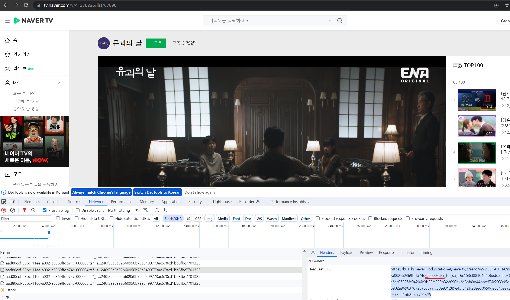
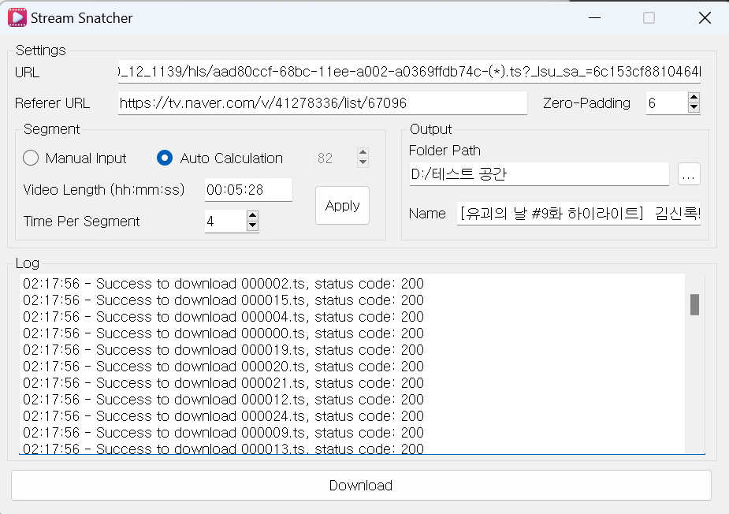
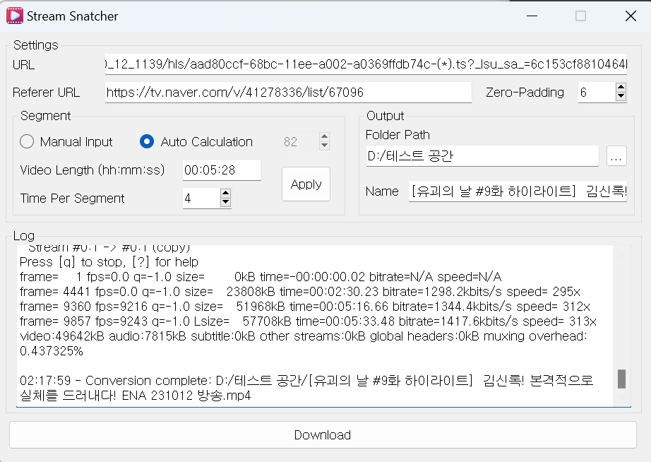
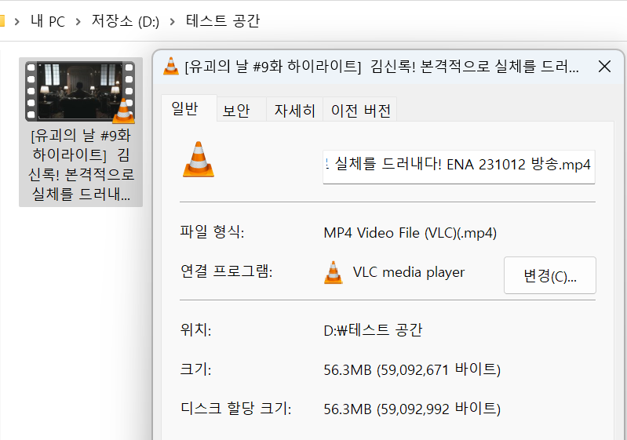

# StreamSnatcher
Stream Media Downloader

## Prerequisites

- **[ffmpeg](https://ffmpeg.org/):**
  This project requires FFmpeg to handle multimedia data. Please ensure to install it on your system. You can download it from the [official FFmpeg website](https://ffmpeg.org/download.html) or install it using a package manager.

## Commends
- Extracting pip dependencies
  ```shell
  pip freeze > requirements.txt
  ```
- Install pip dependency
  ```shell
  pip install -r requirements.txt
  ```
- Open pyqt designer
  ```shell
  designer
  ```
- Packaged as an exe file
  ```shell
  pyinstaller StreamSnatcher.exe.spec
  ```
  
## Screenshot







